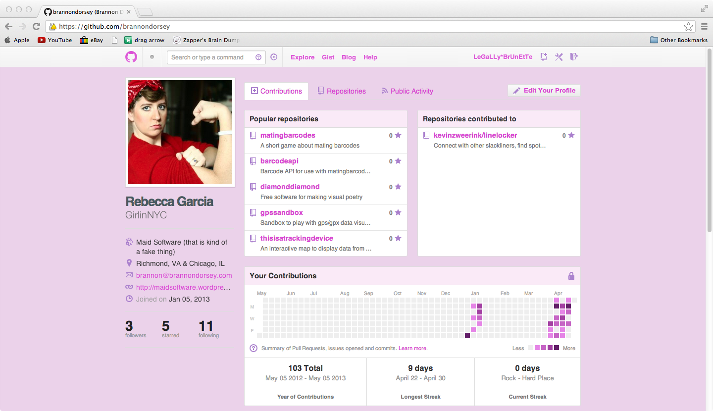

girlsvsgit
==========

GIRLS VS GITHUB

Every username on github is replaced with a generic
female username. every gravatar is replaced with a gravatar of a woman or female type image.

Gravatars are pulled from womens facebok and ravelry accounts (with permission)

Why? There is a dearth of women contributing to open source
software. This plugin is presented as a "filter" to challenge
assumptions about gender roles in software, and to "rewire" your
brain. 

The actual goal is to present such a ridiculous
"plugin" that people get frustrated and start a deeper discussion and
argument about gender and open source.

possible username examples: jenny88, jess2x, _amanda, ashley1982, sarah329,
hannahk, stephanieq... or maybe pull less spammy names like JessicasMommy, GirlinNYC, etc

implementation notes: available as a browser plugin. gravatar images
are trivial to identify and replace, usernames replaced at random. 

replacement usernames and avatars should be
chosen using the original values as a seed so the replacement is
one-way rather than completely random.

Also background, font and style sheets are changed to be more 'radically' female friendly- this mean obnxiously pink and frilly

the origional idea of this plugin was birthed by @kylemcdonald on the @fatlab listerserve. 

wish list:

* working safari and chrome extensions
* new gravatars will be seeded to user id on git so they dont loop
* gravatars and usernames will be pulled from females twitter accounts via twitter api
* embeded 'girly' fonts and style sheet colors changed 
* extended to other tech sites such as slashdot usernames/stackoverflow etc..pirate bay etc.. 

